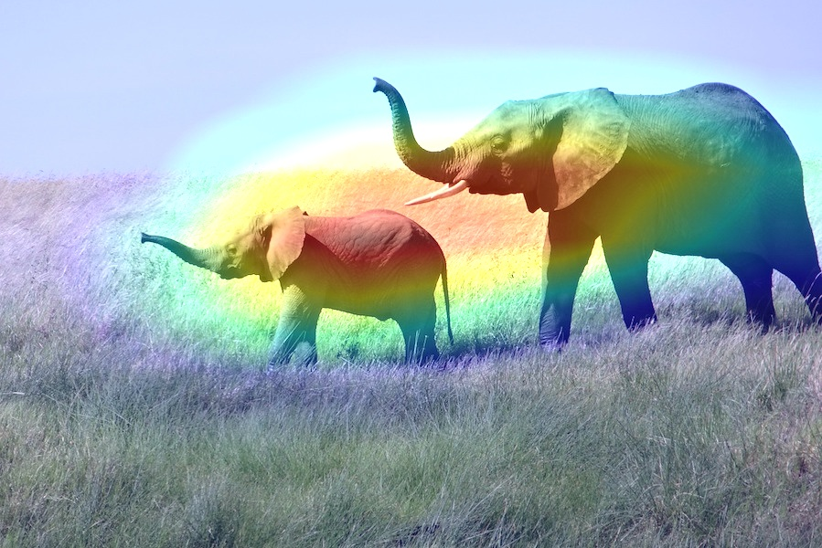

# Heatmap Project

By using weights of a pretrained network and photoset, this code can create heatmap images for each image and each convolution layer in the network. You can see which parts of an image is important for the network to make that particular prediction.

<p align="center">
  
</p>

You can execute the code with 
```
python heat.py --dataset name_of_the_photo_folder -- model name_of_the_saved_model_file --class class_number
```
example: 
```
python heat.py --dataset photos --model weights.hdf5 --class 0
```

If you want to see the heatmap that shows important parts of the image to classify the image as positive, set class_number = 1.
If you want to see the heatmap that shows important parts of the image to classify the image as negative, set class_number = 0.

Note that photo folder and hdf5 file should be in the same folder with the code. It creates heatmaps folder and conv2d folders in that heatmaps folder. In each folder you can find heatmap versions of each image.